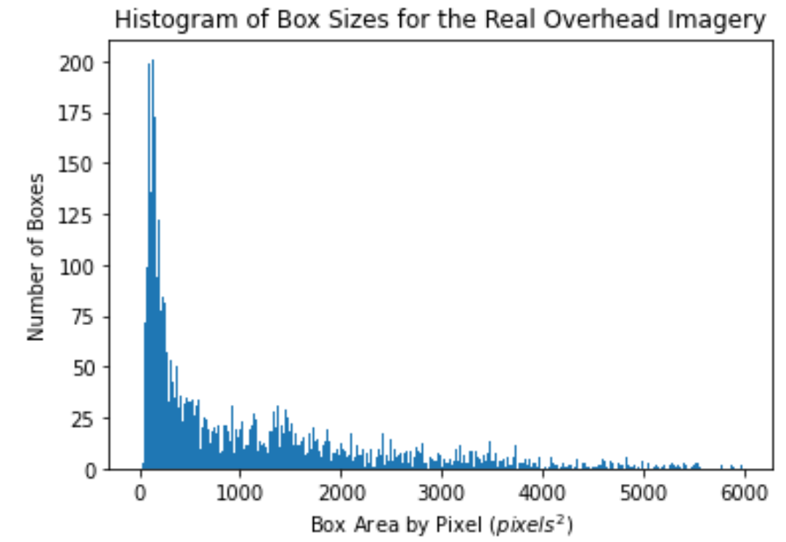

# Miscellaneous-Code

## Purpose
This repo is meant to contain a variety of indpendent helper code that makes figures, manages data, and so on.

## File Descriptions
### pr_curve.py
This file uses the precision.txt and recall.txt files generated from training runs and creates/saves Precision-Recall curves using that data. It can take any number of pairs of data for precision and recall to create multiple PR curves on the same figure. To run this on your own files, make sure the main function at the bottom has the correct paths and is using the function you want.

Given the same precision.txt and recall.txt files, you can use the metrics() function to retrieve the max precision, max recall, and max f1 of the model.

### category_and_region_EDA.py
This file can be used to retrieve information about the number of images, number of turbines (including small and large), and the average number of turbines per image for each region (Southwest, Northeast, Northwest, Eastern Midwest, Western Midwest) and for each category (deserts, farmlands, grasslands, forests, urban/suburban, water). To use this on your own, it's easiest to sync Duke Box onto your computer and then change the IMG_DIR and LBL_DIR to your specific file paths.

### wtb_dataset_EDA.py
This file is used to generate a histogram of the number of images per state. As input, this takes a directory that contains .jpg images, where the image names are in a format similar to naip_325_AZ_WND_..., where they contain the information of the state that the image is from. To use on your own directory, change the DATA_DIR on line 17.

### wtb_dataset.py
This file is used to retrieve the images of a certain powerplant type from the 530764 file in the [Power Plant Satellite Imagery Dataset](https://figshare.com/articles/Power_Plant_Satellite_Imagery_Dataset/5307364) and convert it into a form that can be annotated, adding a mask that shows the location of the power plant so that the images can be labeled faster. These masks are also in the Power Plant Satellite Imagery Dataset, and were were collected through Amazon Mechanical Turk. DATA_DIR is the path to the 530764 directory, and SAVE_DIR is the path to the directory where you want the images saved.

### Changing_Labels_to_Large_and_Small_Wind_Turbines.ipynb
This file is used to take the labels from the Baseline dataset (real overhead images) from Duke Box, and then create new labels by altering the class value for each wind turbine in each label to be '0' for large turbines and '1' for small turbines. It does this using a threshold value, and altering the '0' class value to a '1' if the area of the current ground truth box is smaller than the threshold.

The first code block is to generate a histogram of wind turbine ground truth areas and see how many of them fall below a specified threshold. The second code block is to pull up a specified sample image and print out the box areas for the wind turbines in the image to get a sense of these values with the wind turbines in the actual images. The third code block is then to create new labels that include small and large wind turbines as separate classes by comparing the box area for each wind turbine with the chosen threshold.

### tiles.geojson
This is a [geojson file](https://en.wikipedia.org/wiki/GeoJSON) containing locations and other information about all of the real overhead wind turbines images that were collected from the Power Plant Satellite Imagery Dataset. To view a map of these locations, download this file and go to [geojson.io](https://geojson.io/). Then you can drag and drop this file directly onto the map.

